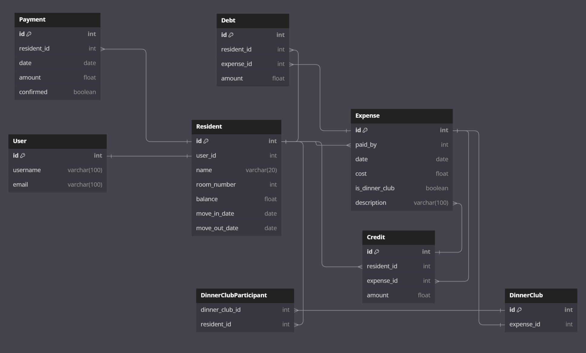

How to run:
1. Create a virtual environment: python -m venv .venv
2. Activate the environment: .venv\Scripts\activate
3. Install the requirements: pip install -r requirements.txt
4. Apply migrations: python manage.py migrate
5. Run the sever: python manage.py runserver
6. Open new terminal
7. change folder: cd frontend
8. install dependencies: npm install
9. Run the frontend: npm start
10. Deactivate the virtual environment when finished: deactivate

DB diagram

